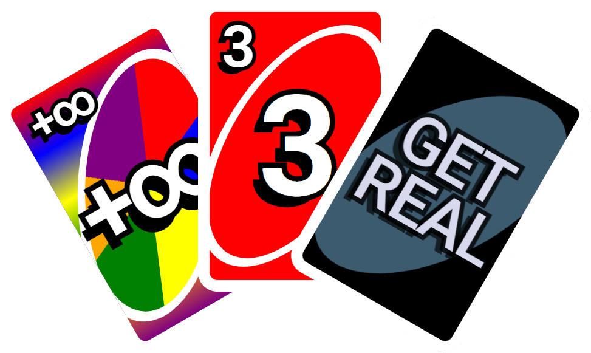
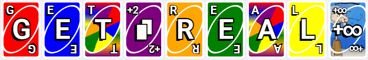
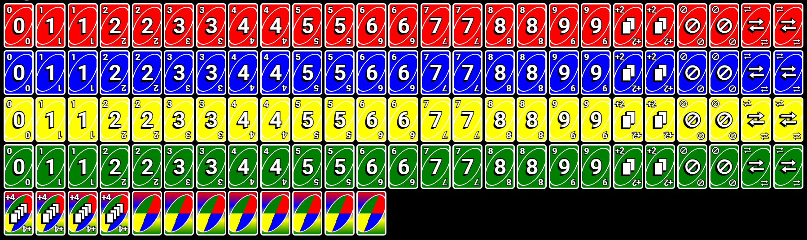
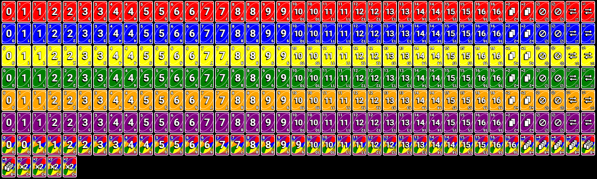
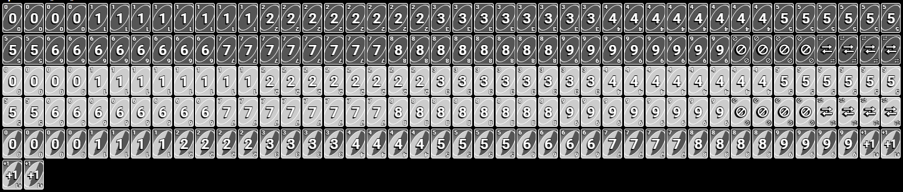
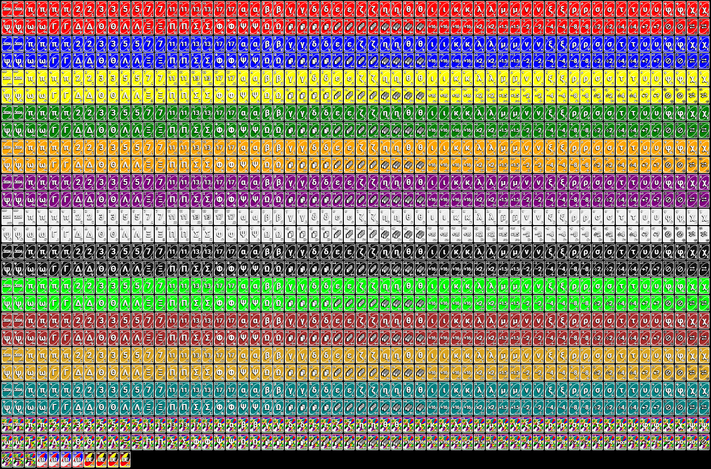

# Get Real!

An UNO™-inspired real-time multiplayer card game made with Next.js and socket.io.
Deployed at: https://getreal.crab.trade/

> Thanks for the cards, but we'll take it from here

https://github.com/user-attachments/assets/2485a644-a2fe-4e5a-b252-e7e0948f229b

A card game with custom pickup cards, multiple different decks, and rules that people _actually_ play with:

-   You can play multiple cards in one turn, given that they have the same number or symbol.
-   You can stack pickups to avoid picking up and pushing it to the next person.
-   Points? What are those? Winners are determined by order of finishing.
-   There is no player limit in either direction. You can play solo if you want! Not sure why you'd do that though.
-   Pickups don't skip player turns. The skip card exists for a reason.

Get Real offers several different decks to choose from:

## Original

The original UNO:tm: deck with 112 cards. Nothing special here.

## Get Real: Normal

An expanded version of the original deck with 6 colors, numbers 0-16, wild numbers, +8s, and x2s.

## Speedrun

A version of the normal Get Real with only 2 colors, 8 of each number, and +1s.

## Cursed

A very cursed deck. Includes 12 colors, +∞, french and german wild cards, and lots more. Contains 1571 cards in total.

## Neverending

A massive deck with equally massive pickup cards. Contains 161 colors (one for each named CSS color!), +∞, +1000, and other devastating cards.
